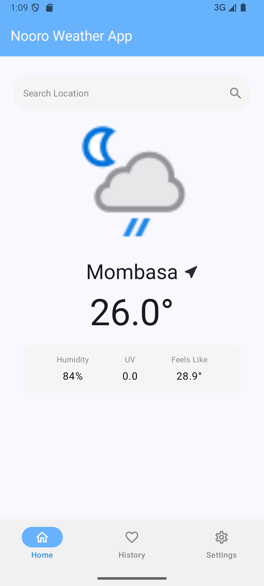
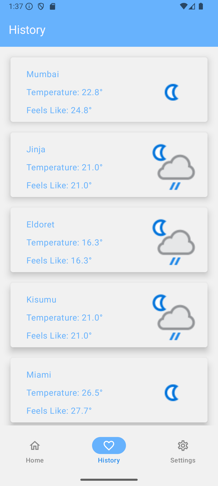
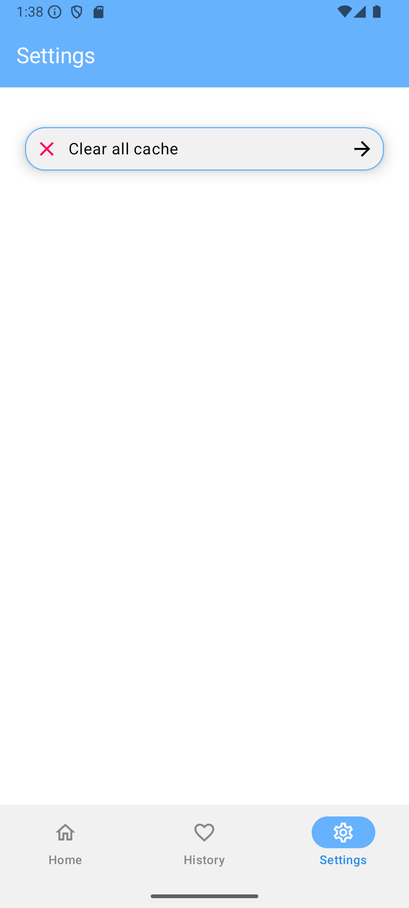
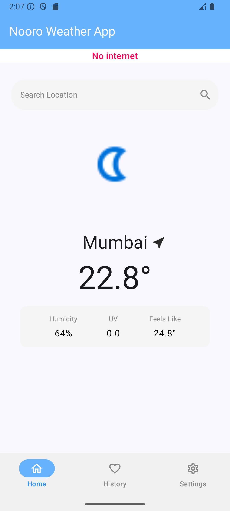

# _Project Setup Guide_

## Prerequisites

- Android Studio
- Git

## Installation Steps
- Clone the master branch
- Open in Android Studio

## Launch Android Studio
- Select "Open an existing project"
- Navigate to the cloned repository
- Select the project directory

## Install Debug App

- Connect an Android device or set up an emulator
- Click "Run" (green play button) in Android Studio
- Select your target device
- Wait for the app to build and install

## Troubleshooting

- Ensure you have the latest Android SDK tools
- Verify your device/emulator meets minimum API requirements
- Check internet connection for gradle dependencies

## Recommended Environment

- Android Studio Meerkat or Hedgehog
- Gradle 8.0+
- Kotlin 2.0

## Architecture and Components
- Modular app structure (core, presentation and app modules)
- MVVM,
- Jetpack compose,
- DataStore for caching data,
- Koin for DI,
- Coil for image loading

## Screenshots

### Home Screen

### History Screen

### Settings Screen

### No Internet scenario

### Search Screen

